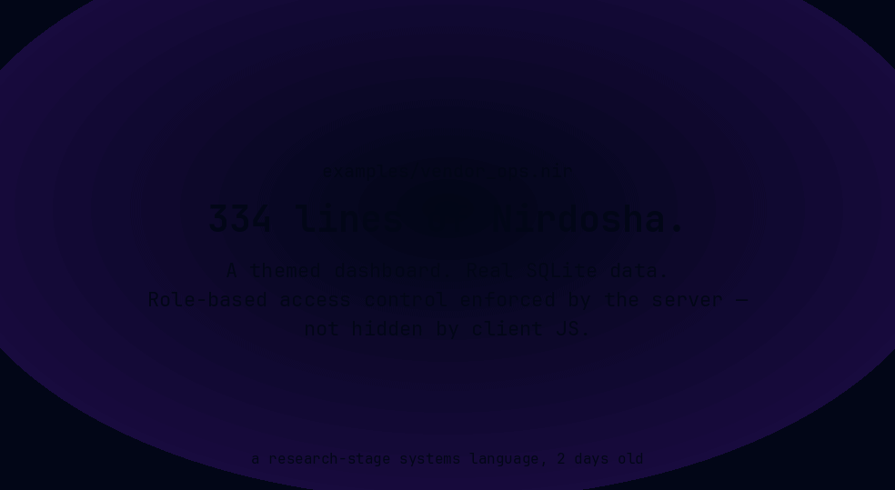

# Nirdosha — निर्दोष ("without fault")

[](https://github.com/arunsoman/nirdosha/actions/workflows/build.yml)
[](./LICENSE)

> A research-stage systems language with no garbage collector, no data races,
> no deadlocks, no integer/buffer overflow, and hardware-native speed —
> *and* a small, composable grammar that an LLM can write and reason about
> as a first-class programmer, not a guest typing into a text box.

Status: active research prototype. The compiler is a real, runnable Rust
crate (`compiler/`); many safety properties are *proven* today and some are
*aspirational* (called out honestly below). Source files use the `.nir`
extension.



*Zero UI code. `nirdosha serve examples/store.nir` derives the whole screen
above — including the `requires(role: "admin")` gate and the custom
"Restock +10" action — from `struct Product` and its `list_/create_/
update_/delete_product` functions. Login goes through a real mock IdP
(`examples/identity_mock.nir`), and the create call really persists to
SQLite (not simulated for this recording — see §6, §9).*

---

## Table of contents

1. [What the name means](#1-what-the-name-means)
2. [Motivation](#2-motivation)
3. [Who this is for (and who it isn't)](#3-who-this-is-for-and-who-it-isnt)
4. [Grammar](#4-grammar)
5. [Features](#5-features)
6. [The UI engine](#6-the-ui-engine)
7. [Benchmarks](#7-benchmarks)
8. [LLM integration](#8-llm-integration)
9. [Try it out today](#9-try-it-out-today)
10. [Honest scope](#10-honest-scope)

---

## 1. What the name means

**Nirdosha** (निर्दोष) is Sanskrit for *without fault / flawless / innocent*.
The name is a design statement, not a marketing claim: the language is
shaped around the goal of a program that passes the compiler being
**provably free of an enumerated set of faults** — use-after-free, data
races, deadlocks, integer/buffer overflow — rather than "fast and usually
safe." When the checker can't prove a correct program correct, the program
is **rejected**, not silently accepted (see §2). That is the price of the
guarantee, and the name states it up front.

## 2. Motivation

The design is driven by **eleven requirements, treated as one set** —
because none of them stands independently of the others. Roughly half are
things a compiler can *prove* (hard), half are things that can only be
*measured* against how humans and models behave (soft). A design that
satisfies only the provable half is Idris2/ATS: correct and nearly unused.
A design that satisfies only the measured half is Go/Python: usable and
unsafe. Nirdosha's thesis is that **both halves must be designed together
from the start**.

| # | Requirement | Class |
|---|---|---|
| 1 | No GC, no manual `free()` | proof (ownership / linear types) |
| 2 | No data races | proof (type system rules out aliased mutation) |
| 3 | No deadlocks | proof-by-construction (no blocking locks; concurrency = async messages) |
| 4 | No int / buffer overflow | SMT-discharged refinement types, tiered |
| 5 | Native, hardware-speed codegen | engineering (AOT via LLVM/`clang`) |
| 6 | No steep learning curve | measured (small, orthogonal grammar) |
| 7 | Easy for an LLM to write/reason about | measured + one hard sub-property (decidable grammar) |
| 8 | Logical, composable syntax | compositionality of the semantics |
| 9 | AI as a first-class citizen | measured; agent-facing API is hard-typed |
| 10 | Tamper-evidence — detect "alien" code in the binary | proof (reproducible builds, content-addressed source) — **aspirational** |
| 11 | Closed product types, sum types, generics | proof (decidable) — `struct`/`enum`/`match` + per-instantiation generics |

**The constraint that shapes everything** is Rice's theorem (1953): no
algorithm can decide a non-trivial semantic property (termination, race,
overflow) for *every* program in a Turing-complete language. So Nirdosha's
type system is deliberately **conservative** — like Rust, SPARK Ada, F*,
Pony — accepting a smaller language in exchange for the guarantee
"everything this accepts is safe." The real design question is therefore
*where the conservative boundary sits, and what the programmer — human or
model — does at it.* That boundary matters equally for formal-methods
correctness and for whether an LLM can reliably work around it.

## 3. Who this is for (and who it isn't)

The honest fit, not the marketing one.

**Squarely for:**

- **Backend/network services written or maintained by an AI coding agent,
  with no human reviewing every line before it runs.** This is the one
  problem nothing else on the market is built for from the grammar up: an
  LL(1) grammar exported to GBNF lets a sampler force every token an agent
  emits to stay syntactically valid; `--format=json` gives a self-repair
  loop a structured proof obligation instead of a paragraph to guess at;
  `sandbox` is a real OS process and a language primitive, not a bolted-on
  Docker wrapper around output nobody trusts; and there is no mutex in the
  language, so an agent literally cannot generate a deadlock. If you're
  building an autonomous coding agent, or letting one operate against
  production, this is the concrete gap Nirdosha targets.
- **Compliance-shaped CRUD systems** — trade finance, KYC/onboarding,
  anything where "who is allowed to call this" is part of the spec, not an
  afterthought. `requires(role: "admin")` / `requires(claim: "department",
  "cardiology")` are type-checked at the call site, not `if user.role ==
  "admin"` sprinkled through handlers — §6's UI engine derives the
  login/role gate automatically from the same annotation.
- **Deterministic simulations and audits**, where "run it twice, get the
  same trace" matters. `rand_seed` resets a from-scratch RNG with no OS
  entropy, so a run is byte-for-byte reproducible from a seed.

**Not (yet) for:**

- OS/kernel or embedded work — no `no_std`, no freestanding target; the
  runtime assumes a real OS underneath it for threads and processes.
- General frontend/UI work — `emit-ui`/`serve` generate CRUD + dashboard
  screens from struct/fn naming, not a general application-UI framework.
- Anything where you need the crate ecosystem, hiring pool, or decade of
  production hardening Rust/Go already have. Nirdosha is two days into
  being public; picking it over Rust today is a research bet, not an
  engineering one — see §10.

## 4. Grammar

The parser (`compiler/src/parser.rs`) is **hand-written recursive descent
with strictly one token of lookahead and no backtracking, anywhere** — the
operational definition of **LL(1)**. Binary-operator precedence is handled by
precedence climbing, not left-recursive grammar rules, which is what keeps
the expression grammar LL(1)-parseable without a transformation step.

### Independent cross-checks

Nirdosha is unusual in that its grammar claims are **verified by external
tools**, not just asserted by re-reading the hand-written parser:

- **`grammar_check/`** — feeds the grammar to `lalrpop` (an independent
  LALR(1) generator). This cross-check found something real: because the
  language has **no statement separator** (no semicolons, no significant
  newlines), the grammar as an abstract CFG is ambiguous wherever a token
  could either extend an expression or start a new statement. The parser
  resolves every such case deterministically with one rule:
  **always extend the current expression over ending the statement**
  (shift over reduce, no exception). So `return x` followed on the next
  line by `-y` parses as `return (x - y)`, not as two statements. The
  hand-written parser is unambiguous; the bare CFG is not, without this
  rule stated explicitly — a distinction only visible by running a second
  tool against it.
- **`grammar_export/`** — hand-translates the grammar to **GBNF**
  (`compiler/nirdosha.gbnf`), the constrained-decoding grammar artifact for
  LLM samplers (row 7). Validated two ways: by `llama-cpp-gbnf` (the real
  llama.cpp parser, which caught a real bug during writing), and by running
  a corpus — every shipped `.nir` example plus rejection cases — through
  the GBNF and confirming it accepts/rejects exactly what the real compiler
  does.

### EBNF shape

Top-level: `item ::= fn_decl | struct_decl | enum_decl | screen_decl |
dashboard_decl`. The full EBNF lives in [`GRAMMAR.md`](./GRAMMAR.md).
Notable choices:

- **No statement separators** (see the disambiguation rule above).
- **Keyword-heavy over symbol-heavy** syntax (aids LLM reliability, row 7).
- **Construction is an ordinary call**, not a separate literal form — a
  `struct`'s name is its own positional constructor via `Expr::Call`.
- **Contextual keywords** (`field`, `action`, `tile`, `chart`, `role`,
  `claim`) are matched only in their leading slot, so they stay ordinary
  identifiers everywhere else.

## 5. Features

Mined from the actual implementation (`compiler/src/`), not the design
docs. See [`LANGUAGE.md`](./LANGUAGE.md) for the authoritative reference.

### Types
Signed/unsigned ints (`i8`..`i64`, `u8`..`usize`), `f64` (IEEE-754, saturating),
`bool`, `unit`, `str` (UTF-8, `Arc<str>`-backed), `box T` (single-owner heap),
`&T` (read-only borrow of an identifier), `thread T`, `chan T` (unbounded
MPMC), `sandbox`, `tcp`/`tcp_listener`, `file`, `VerifiedIdentity`/
`RoleView`/`ClaimView` (identity proofs), `Vector(T, N)` and
`Matrix(T, R, C)` (fixed-shape, fixed-length — `Vector(f64,3) ≠
Vector(f64,4)`).

### Ownership & affine types (row 1, 2)
`box T` is single-owner; moving into `spawn`/`send`/`stop` consumes it.
`&T` is a read-only borrow. The ownership checker (`ownership.rs`) enforces
the linear discipline statically — no use-after-free, no aliased mutation,
no GC. Cyclic structures are the known hard case (an arena escape hatch is
the planned answer).

### Concurrency (rows 2, 3)
- `spawn f(args)` — real OS thread, returns `thread T`; `join` consumes it
  once.
- `chan T` — unbounded MPMC channel; the handle is freely copyable, the
  *payload* moves through `send`.
- `sandbox worker(args)` — a **real, separate OS process** (a fresh
  `nirdosha` invocation), affine `sandbox` handle; `stop` terminates it. A
  handle that goes out of scope unstopped still kills its process (no
  zombies) — deterministic cleanup, not discipline-dependent.

There is no mutex in the language; a deadlock is not *expressible*. Hot
paths that want shared-memory locks get re-cast as messages.

### Effects (rows 4, 9)
`effect(...)` annotations are **fully inferred by default** (no notation
paid unless load-bearing). A declared annotation is checked against what
the body actually does — an effect performed but not declared is a
compile error, not a silent gap. `effect(pure)`, `effect(io)`, etc.

### Refinement types & SMT (row 4)
Integer/buffer bounds proofs are discharged by an SMT solver (Z3, via
`refine.rs` / `smt.rs`) at compile time, **tiered**: Tier-1 attempts a
static proof; Tier-2 inserts a runtime guard when a fact isn't SMT-decidable
in scope; `audited "justification" { ... }` is the one documented escape
hatch that suppresses guards with a human-language justification (the one
place a human review gate stays mandatory).

### Determinism (row 9)
`rand_seed(seed)` resets a from-scratch SplitMix64 RNG (no OS entropy, no
hidden global state). `rand_f64` / `rand_gaussian` draw from it. A
simulation's random draws are byte-for-byte reproducible from a seed — the
foundation of `bench/`'s `run-deterministic` (run + hash-check) and of
auditable simulations.

### Identity, roles, claims (row 12)
`oidc_validate_token(...)` validates an externally-issued OIDC/JWT ID token
(HMAC-SHA256) and returns a `VerifiedIdentity` — the runtime **never mints
tokens, only consumes them**. `check_role` / `extract_claim` (and their
dotted-path siblings for nested IdP schemas like Keycloak) produce
`RoleView` / `ClaimView` proofs. `requires(role: "admin")` /
`requires(claim: "department", "cardiology")` on a `fn` demands such a
proof at the call site — capability-gated, statically tracked.

### Data types & generics (row 11)
`struct`, `enum`, and `match` (exhaustive, no wildcard/binding patterns in
v1). Type parameters are **concrete-per-instantiation**: `Pair(i64, str)`
and `Pair(f64, bool)` are different, unrelated types — no monomorphizer
pass exists or is needed. `Option(T)` and `Result(T, E)` are ordinary
generic `enum`s injected into every program at parse time. Affinity
propagates through struct/enum fields and through a generic instantiation's
own concrete type arguments, the same way it does through `box`.

### Dense linear algebra (row 5)
`Vector` and `Matrix` with `transpose`, `dot`, `cross` (3-vectors),
`zeros`/`ones`/`identity`, `sum`, `len`, `norm`/`norm1`/`norm_inf`,
`frobenius_norm`, `trace`, matrix×matrix and matrix×vector multiply with
shape checking at typecheck time. `Vector * Vector` is a **type error by
design** (ambiguous inner vs. outer product) — use `dot()`. The whole
linalg feature set is modeled on Julia and now **compiled** (see §7).

### I/O & networking
`print`, `file` handles (`open`/`read`/`write`/`stop`), `tcp` client
(`connect`), `tcp_listener` (`listen`/`accept`/`stop`), JSON, a `db`
builtin (SQLite via rusqlite, or Postgres via `postgres`/
`postgres-native-tls` — picked by `db_connect`'s own connection-string
scheme, see [`PROTOLANG_PORT.md`](./PROTOLANG_PORT.md)'s "Locked design
5: DB"), `transact` semantics (see [`TRANSACT.md`](./TRANSACT.md))
including cross-process transactions, and a `redis`-backed message queue.

### Structured diagnostics (row 9)
Every error — type, ownership, runtime — has **one structured shape**
(`Diagnostic` JSON via `--format=json`), not English prose. This is what
makes the LLM self-repair loop (§8) possible: the model gets a
machine-parseable proof obligation back, not a sentence to guess at.

## 6. The UI engine

Nirdosha ships a **declarative UI DSL** plus a UI generator that derives a
full CRUD + dashboard web application from a program's `struct`
declarations and its function-naming conventions — **no UI syntax needed
for the common case**.

### Zero-syntax inference
`compiler/src/ui_gen.rs` looks for `list_<struct>`, `create_<struct>`,
`update_<struct>`, `delete_<struct>`, `get_<struct>`, and
`stat_<name>` / `chart_<name>` functions and generates a complete
HTML/JS CRUD app + dashboard from them alone.

### Optional `screen` / `dashboard` blocks
For what a naming convention can't express (a friendlier title, a
relabeled field, a custom action), there is an **additive** DSL:

```nirdosha
struct Product {
    id: i64,
    name: str,
    price_cents: i64,
    stock: i64,
}

fn list_product() -> Result(json, str) { ... }
fn create_product(p: Product) -> Result(i64, str) requires(role: "admin") { ... }
fn restock_product(id: i64) -> Result(i64, str) requires(role: "admin") { ... }

screen Product {
    title: "Catalog"
    field name { label: "Product Name" }
    action "Restock +10" -> restock_product {
        style: "outlined"
        confirm: "Restock this product by 10 units?"
    }
}

dashboard {
    tile "Products" -> stat_product_count
    chart "By Price" -> chart_products_by_price
}
```

- `screen`/`dashboard` are real reserved keywords (top-level items like
  `struct`/`fn`); `field`/`action`/`tile`/`chart` are contextual keywords.
- Typechecked: `screen <Name>` must name a real `struct`; `field`/`action`
  targets must resolve; `view`/`edit` must be `role(...)`/`claim(...)`.
- **Inert to native codegen** — `nirdosha build` compiles a program
  containing `screen`/`dashboard` cleanly (codegen never inspects them).
  They're consumed only by `nirdosha emit-ui` / `nirdosha serve`.
- Tracked-but-not-wired (see [`compiler/UI_DSL_TODO.md`](./compiler/UI_DSL_TODO.md)):
  `paginate`, `searchable`/`sortable`, server-side role/claim visibility.

### Serving
`nirdosha serve <file.nir>` runs a `tiny_http` server exposing the inferred
functions as a JSON API (`POST /api/<fn>`), with optional OIDC JWKS/issuer/
audience gating — the same identity primitives as §5, applied to HTTP.

## 7. Benchmarks

Full methodology and caveats in [`benchmarks/RESULTS.md`](./benchmarks/RESULTS.md).
Numbers are **compiled-vs-compiled**, best-of-3 wall time, every output
verified bit-identical across all languages before any timing was trusted.

### Group A — dense linear algebra (Julia-derived features)
Nirdosha compiled vs. Julia (JIT) vs. C. 200,000 iterations.

| Benchmark | C (gcc -O2) | Nirdosha (compiled) | Julia (JIT) | vs. Julia | vs. C |
|---|---:|---:|---:|---:|---:|
| `matmul` (4×4) | 0.0102 s | **0.0018 s** | 0.794 s | **441× faster** | 5.7× faster |
| `det` (4×4) | 0.0093 s | 0.0272 s | 0.993 s | **36.5× faster** | 2.9× slower |
| `dot` (8-vec) | 0.0023 s | **0.0017 s** | 0.418 s | **246× faster** | 1.4× faster |
| `kalman` (4-state) | 0.0798 s | 0.3274 s | 2.735 s | **8.4× faster** | 4.1× slower |

**Decisive win over Julia on all four once compiled.** The honest asterisk:
Nirdosha loses to hand-specialized C on `det`/`kalman` because those go
through a runtime-parameterized native call LLVM can't inline for `n=4`,
while `matmul`/`dot` are fully unrolled at codegen time into straight-line
IR. A future per-size monomorphization pass would likely close the gap.

### Group B — scalar / control flow
Nirdosha compiled (`-O2`, default) vs. C vs. Julia.

| Benchmark | C (gcc -O2) | Nirdosha (`-O2`) | Julia (ref) |
|---|---:|---:|---:|
| `fib(35)` | 0.018 s | **0.026 s** | 0.283 s |
| `floatloop` (2×10⁸) | 0.443 s | **0.436 s** | 0.686 s |

Within **1.4×** of `gcc -O2` on `fib`, and **noise-level tied** with C on
`floatloop` — exactly where a thin LLVM-backed AOT compiler should land.
(For reference: interpreted Nirdosha on `fib(35)` was 16.1 s — 620× slower
than compiled; compiling linalg was the whole point of prioritizing
codegen there.)

Benchmarks live in [`benchmarks/{c,julia,nirdosha}/`](./benchmarks/).

## 8. LLM integration

Nirdosha is designed so an LLM is a **first-class programmer**: agents emit
**typed AST/IR fragments the compiler validates before splicing**, not raw
text, and compiler errors return **structured proof obligations**, not prose.
This is grounded in capabilities that already exist today:

| Problem today | Nirdosha's answer (shipped/planned) |
|---|---|
| Code looks right but is syntactically invalid | LL(1) grammar + GBNF export → **constrained decoding** |
| Parse errors are prose → guesswork repair | `--format=json` → **structured `Diagnostic`** |
| Type-checks but has subtle safety bugs | `refine.rs` + `smt.rs` → **SMT-discharged bounds proofs** |
| Running LLM code safely = bolted-on Docker | `sandbox`/`stop` → **real OS process isolation, language primitive** |
| Repeated runs give different results | `rand_seed` → **deterministic RNG** |
| Can't improve a generation incrementally | `validate_fragment` → **type-check expression fragments in context** |
| Can't measure domain progress | `bench/` corpus → **pass@1 + self-repair rate** |

### Agent-facing API
[`nirdosha-agent-api.md`](./nirdosha-agent-api.md) specifies a local
HTTP API (`http://localhost:7878`) wrapping these capabilities into
callable endpoints, grouped:

- **A. Code Generation & Validation** — `/v1/generate`, `/v1/validate`,
  `/v1/validate-fragment`, `/v1/repair`, `/v1/splice`
- **B. Execution & Simulation** — `/v1/run`, `/v1/run-sandboxed`,
  `/v1/run-deterministic`, `/v1/build`
- **C. Compiler Introspection** — `/v1/grammar` (the GBNF), `/v1/types`,
  `/v1/builtins`, `/v1/emit-ast`
- **D. Benchmarking & Evaluation** — `/v1/bench/run`, `/v1/bench/repair-rate`
- **E. Provenance & Reproducibility** — `/v1/provenance/hash`,
  `/v1/provenance/verify`, `/v1/provenance/audit` (row 10 — planned)

Every endpoint references something already built or explicitly planned
in [`Nirdosha_Unified_Plan.md`](./Nirdosha_Unified_Plan.md); nothing is
aspirational hand-waving.

### Constrained decoding
`compiler/nirdosha.gbnf` (produced/tested by `grammar_export/`) is a
grammar-constrained-decoding artifact an LLM sampler (llama.cpp etc.) can
load to **guarantee every token emitted stays inside Nirdosha's syntax** —
the same way an LSP keeps an IDE's completions valid. This is the hard
sub-property of row 7, and it's decidable/checkable against the real
compiler's accept/reject behavior.

### Benchmark harness
[`bench/`](./bench/) is a pass@1 + self-repair-rate harness with a
`corpus.json` of 23 tasks spanning the language's shipped features. It
feeds each attempt's structured `Diagnostic` back in as the next attempt's
context — the same re-prompt loop a real self-repair integration would use.
It ships mock models today; wiring a real LLM API is a distinct, separate
piece of work the harness is built to plug into.

## 9. Try it out today

### Build the compiler

```sh
cd compiler
cargo build --release
# binary: compiler/target/release/nirdosha
```

Toolchain: Rust (edition 2024), plus two system libraries the build links
against directly — install these *before* `cargo build` or the build fails
with a linker error, not a friendly message:

```sh
# Debian/Ubuntu
sudo apt install clang libz3-dev

# macOS (Homebrew)
brew install llvm z3

# Arch
sudo pacman -S clang z3
```

`clang` is invoked at runtime by `nirdosha build`/`emit-llvm` (native codegen);
`z3` is linked at compile time for the SMT refinement layer (row 4) and is
required even just to build the compiler, not only to use that feature.

### Run a program

```sh
# Interpret (always works for every construct)
nirdosha examples/hello.nir

# Compile to a native binary (subset — see LANGUAGE.md §10)
nirdosha build examples/matrices.nir -o matrices
./matrices

# Inspect the program
nirdosha emit-llvm examples/matrices.nir   # print LLVM IR
nirdosha emit-ast  examples/matrices.nir  # print AST as JSON
```

### Generate / serve a UI

```sh
nirdosha emit-ui examples/store.nir -o store.html   # self-contained CRUD HTML
nirdosha serve   examples/store.nir --port 8080     # JSON API server
```

### Structured diagnostics (for LLM/agent loops)

```sh
nirdosha examples/broken.nir --format=json   # Diagnostic JSON on failure
```

### Explore the language

- **Full feature reference**: [`LANGUAGE.md`](./LANGUAGE.md)
- **Full grammar**: [`GRAMMAR.md`](./GRAMMAR.md)
- **Every example in one browsable file**: [`all_examples.md`](./all_examples.md) (not in git; generated locally)
- **Design rationale**: [`goal.md`](./goal.md), [`Nirdosha_Unified_Plan.md`](./Nirdosha_Unified_Plan.md)
- **Sandboxing**: [`SANDBOXING.md`](./SANDBOXING.md) · **Transactions**: [`TRANSACT.md`](./TRANSACT.md)
- **Agent API**: [`nirdosha-agent-api.md`](./nirdosha-agent-api.md)

Start small (`hello.nir` → `factorial.nir` → `ownership.nir` →
`borrow.nir`), then concurrency (`threads.nir`, `channels.nir`,
`sandbox.nir`), then the domain-scale examples (`store.nir`,
`transact.nir`, `rev-assurence/`, `trade-finance/`).

## 10. Honest scope

This README states what's real and checkable today vs. what's aspirational,
following the project's own discipline (see `goal.md`'s "Honest correction"
notes):

- **Shipped and checkable**: ownership/affine, concurrency primitives,
  `sandbox`/`stop`, effects inference, `struct`/`enum`/`match`/generics,
  `Option`/`Result` prelude, `Vector`/`Matrix` linalg (compiled), `str`/
  `tcp`/`connect`/`listen`/`accept` (compiled), `box`/`&`/`*` (compiled),
  deterministic RNG, identity/role/claim, structured diagnostics, the UI
  engine (`emit-ui`/`serve`), the GBNF artifact, the benchmark harness.
- **Interpreter-only (rejected at compile time, not mis-compiled)**:
  `spawn`/`join`/`thread`/`chan`/`send`/`recv`, `sandbox`, and
  `struct`/`enum`/`match` over *affine-containing* payloads. A program that
  never actually uses one compiles normally.
- **Aspirational, not built**: row 10's full ambition (reproducible builds,
  content-addressed source, capability manifests at the kernel boundary, a
  signed provenance chain) — a future implementation pass extending the
  deterministic-RNG foundation, not a current claim.
- **Open follow-ups**: per-size monomorphization of the `det`/`kalman`
  runtime kernels; `bench/`'s real-LLM integration; UI DSL's `paginate`/
  `searchable`/`sortable` and server-side role/claim visibility.

For precise syntax and semantics, the compiler sources under
[`compiler/`](./compiler) are the authoritative reference.

---

*निर्दोष — designed so that what the compiler accepts is, provably, without
fault.*